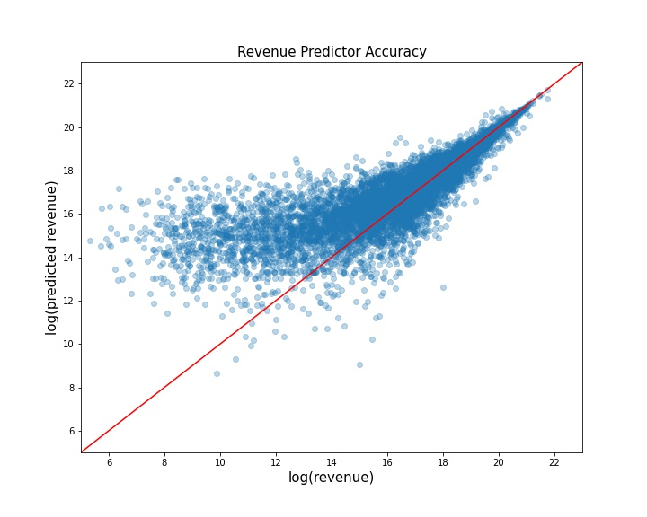
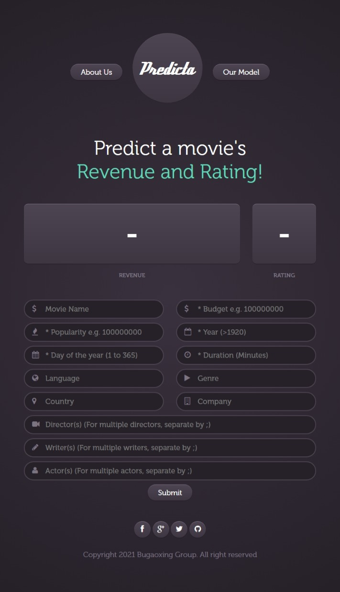

# Film Review & Revenue Predictor

## Background

Producers pitch movie ideas to studios in hopes of making the next blockbuster, or movie theatres may need to know which film will have a higher probability of positive reception. Traditionally producing or hosting a blockbuster film was more art than science.

Our Machine Learning Program enables Producers to better assess and choose which films would be a success and which are likely to flop with greater confidence.

## Status

* Project is finalised
* Published site: https://vic-crime.herokuapp.com/

## Workflow

1. [Data Wrangling](model/01_Data_Wrangling.ipynb)
2. [Model selection](model/02_Model_Selection.ipynb)
3. [Feature selection](model/03_Feature_Importance.ipynb)
4. [XGBoost Model training](model/04_Predictor_XGBOOST_Hyperparameter.ipynb)
5. [LightGBM Model training](model/05_Predictor_LightGBM_Hyperparameter.ipynb)
6. [Web Page Design](templates/index.html)
7. [Web Design](app.py)
8. [Deployment](requirements.txt)

## File description

Raw data [IMDb movies.csv] from [Kaggle](https://www.kaggle.com/stefanoleone992/imdb-extensive-dataset) can be found in [data](data) folder. Cleaned data, including selected features and encoded inputs, can be found in [encoded_data](model/encoded_data) folder. The tuned xgboost and lightgbm models are saved in [model](model) foler.

    .
    ├── analysis            # data and model exploration 
    ├── data                # raw data
    ├── images              # output plot
    ├── model               # model training and cleaned data
    │   ├── encoded_data    # cleaned data
    │   └── ....            # model training codes
    ├── static              # css files
    ├── templates           # html files
    └── ...                 # backend and deployments files

## Result

XGBoost and LightGBM are selected to train for our prdeictor as there are a lot of binary-type inputs in our encoded data. Raw data has around 1870 inputs. We have reduced the number of inputs to around 400 by using XGBoost `_feature_importance`. After hyperparameter tuning, both `XGBoost` and `LightGBM` have good accuracy. LightGBM is 12X faster than XGBoost. However, the accuracy of LightGBM is a little bit worse than XGBoost. So we select XGBoost model for our app.

R2 Score | Revenue Prdictor | Review Score Predictor
---------| ---------------- | ----------------------
XGBoost | 0.78 | 0.61
LightGBM | 0.77 | 0.58

The preditor has been deployed on [Heroku](https://film-predict.herokuapp.com/) and the model traing analysis has also been given in the [model introduction page](https://film-predict.herokuapp.com/model)

To use this app, please fill all  the * field (Budget/Popularity/Year/Day of the year/Duration) in the page.

* Movie name (your interested movie)
* Budget (an `int` number, in US dollar)
* Popularity (an `int` number, the number of people who are interested in this movie)
* Year(an `int` number > 1920)
* Day of the Year (an `int` number range from 1 - 365)
* Duration (an `int number, length of the movie in minutes)
* Others （string, can be multiple items, seperate by `:`)

## Acknowledgements
The data used for this app is scraped from [IMDB](https://www.imdb.com) and provided by [Kaggle](https://www.kaggle.com/stefanoleone992/imdb-extensive-dataset).
